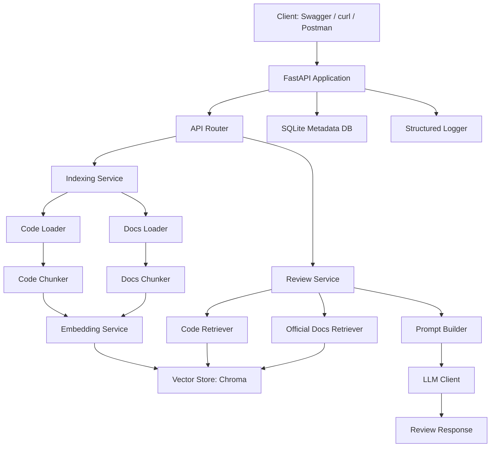
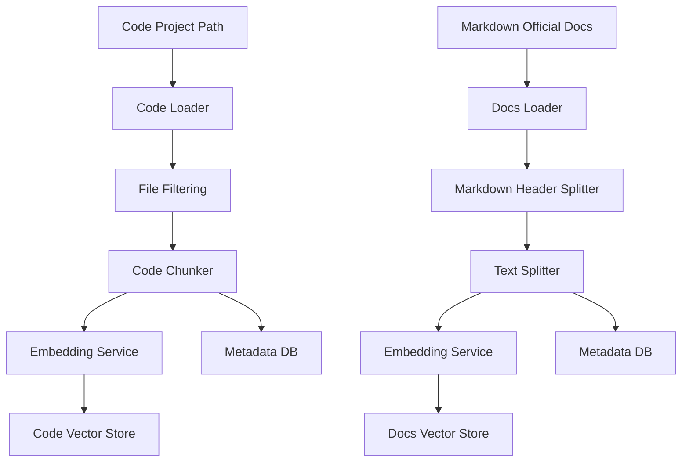
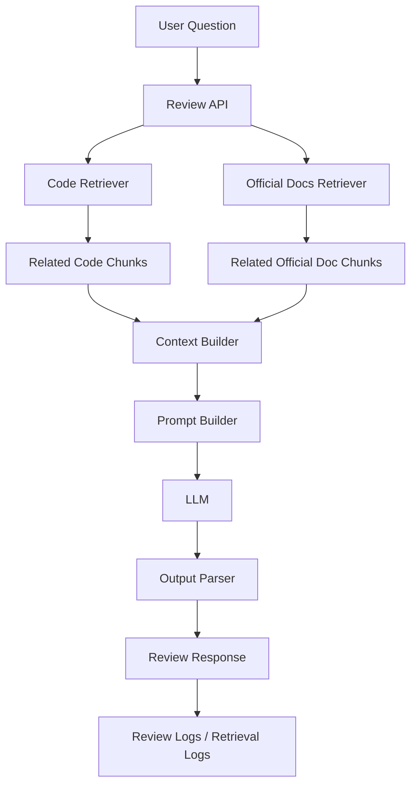

# 03. Architecture

## 1. 문서 목적

이 문서는 RAG Code Reviewer의 전체 시스템 구조, 주요 컴포넌트, 데이터 흐름, 인덱싱 파이프라인, 질의 파이프라인을 설명합니다.

초기 버전은 로컬 환경에서 실행되는 FastAPI 기반 API 서버를 기준으로 합니다.

---

## 2. 전체 아키텍처



---

## 3. 주요 컴포넌트

### 3.1 FastAPI Application

API 요청을 처리하는 백엔드 서버입니다.

역할:

- API routing
- request_id middleware 적용
- exception handler 적용
- Swagger/OpenAPI 문서 제공
- 서비스 계층 호출

---

### 3.2 API Router

기능별 API endpoint를 정의합니다.

예상 router:

```text
app/api/index.py
app/api/reviews.py
app/api/projects.py
app/api/health.py
```

---

### 3.3 Indexing Service

코드와 문서를 인덱싱하는 서비스입니다.

역할:

- 코드 파일 수집
- 문서 파일 수집
- chunk 생성
- embedding 생성
- vector store 저장
- metadata DB 저장

---

### 3.4 Review Service

사용자 질문을 처리하고 RAG 리뷰 결과를 생성하는 서비스입니다.

역할:

- 질문 수신
- 코드 검색
- 공식문서 검색
- context 구성
- prompt 생성
- LLM 호출
- 리뷰 결과 저장
- retrieval log 저장

---

### 3.5 Code Loader

로컬 프로젝트 경로에서 코드 파일을 읽습니다.

초기 지원 파일:

- `.py`
- `.md`
- `.yml`
- `.yaml`
- `.json`

제외 디렉토리:

- `.git`
- `.venv`
- `venv`
- `__pycache__`
- `node_modules`
- `dist`
- `build`
- `target`

---

### 3.6 Code Chunker

코드 파일을 검색 가능한 단위로 분할합니다.

초기 버전:

- 파일 단위 chunking
- 긴 파일은 RecursiveCharacterTextSplitter로 분할

향후 확장:

- Python AST 기반 함수/클래스 단위 chunking
- Java/Spring 메서드/클래스 단위 chunking
- 어노테이션 metadata 추출

---

### 3.7 Docs Loader

Markdown 기반 공식문서 또는 내부문서를 읽습니다.

문서 유형:

- official_doc
- internal_doc
- error_doc
- api_doc

---

### 3.8 Docs Chunker

공식문서를 의미 단위로 분할합니다.

기본 전략:

1. Markdown header 기반 분할
2. 긴 section은 추가 text splitter로 분할
3. source, title, section, chunk_index metadata 저장

---

### 3.9 Embedding Service

문서 chunk와 코드 chunk를 embedding vector로 변환합니다.

초기 후보:

- Mistral Embedding
- OpenAI Embedding

역할:

- text input 정규화
- embedding API 호출
- 실패 시 예외 처리
- token/latency logging

---

### 3.10 Vector Store

embedding vector를 저장하고 검색합니다.

초기 사용:

- Chroma

collection 분리 정책:

```text
code_chunks
official_docs_chunks
```

또는 metadata 기반 분리:

```json
{
  "source_type": "code"
}
```

```json
{
  "source_type": "official_doc"
}
```

초기에는 collection 분리를 우선 고려합니다.

---

### 3.11 SQLite Metadata DB

Vector DB에 저장하기 어려운 메타데이터와 실행 이력을 저장합니다.

저장 대상:

- projects
- documents
- chunks
- reviews
- retrieval_logs
- request_logs
- error_logs

---

### 3.12 LLM Client

LLM API를 호출합니다.

역할:

- prompt 전달
- response 수신
- token usage 기록
- timeout 처리
- API 실패 처리

---

### 3.13 Structured Logger

API 요청과 RAG 실행 과정을 구조화된 로그로 기록합니다.

로그 대상:

- HTTP request
- indexing event
- retrieval event
- LLM call event
- error event

---

## 4. 인덱싱 파이프라인



### 4.1 코드 인덱싱 흐름

```text
1. 사용자가 프로젝트 이름과 root_path를 전달한다.
2. 시스템은 root_path의 유효성을 검증한다.
3. 지원하는 확장자의 파일을 수집한다.
4. 제외 디렉토리는 무시한다.
5. 파일 또는 함수/클래스 단위 chunk를 생성한다.
6. 각 chunk에 metadata를 부여한다.
7. embedding을 생성한다.
8. vector store에 저장한다.
9. documents/chunks metadata를 SQLite에 저장한다.
10. 인덱싱 완료 로그를 남긴다.
```

---

### 4.2 공식문서 인덱싱 흐름

```text
1. 사용자가 Markdown 문서 경로를 전달한다.
2. 시스템은 문서 파일을 읽는다.
3. Markdown header 기준으로 section을 분할한다.
4. 긴 section은 추가 분할한다.
5. 각 chunk에 source/title/section metadata를 부여한다.
6. embedding을 생성한다.
7. vector store에 저장한다.
8. documents/chunks metadata를 SQLite에 저장한다.
9. 인덱싱 완료 로그를 남긴다.
```

---

## 5. 질의 파이프라인



### 5.1 질의 처리 흐름

```text
1. 사용자가 project_id와 question을 전달한다.
2. 시스템은 project_id가 유효한지 확인한다.
3. 질문을 기반으로 code retriever가 관련 코드 chunk를 검색한다.
4. 질문을 기반으로 docs retriever가 관련 공식문서 chunk를 검색한다.
5. 검색된 chunk를 context로 포맷팅한다.
6. 코드 리뷰용 prompt를 생성한다.
7. LLM을 호출한다.
8. 결과를 표준 응답 형식으로 반환한다.
9. review, retrieval_logs, request_logs를 저장한다.
```

---

## 6. 응답 구조

리뷰 응답은 다음 구조를 따릅니다.

```json
{
  "success": true,
  "data": {
    "review_id": 1,
    "verdict": "PROBLEM",
    "answer": "현재 코드는 ...",
    "related_code": [
      {
        "file_path": "app/api/events.py",
        "symbol_name": "create_event",
        "start_line": 31,
        "end_line": 47,
        "score": 0.82
      }
    ],
    "official_references": [
      {
        "title": "Use jsonable_encoder in a Response",
        "source": "fastapi_response.md",
        "section": "JSON Compatible Encoder",
        "score": 0.79
      }
    ],
    "latency_ms": 2840
  },
  "request_id": "req_abc123"
}
```

---

## 7. 설계 원칙

### 7.1 UI보다 API 우선

초기 버전은 프론트엔드 UI 없이 FastAPI Swagger, curl, Postman으로 기능을 검증합니다.

### 7.2 RAG 파이프라인 우선

배포, 인증, UI보다 코드 인덱싱, 문서 인덱싱, 검색 품질, 답변 근거 제공을 우선합니다.

### 7.3 로깅과 추적성 우선

모든 요청과 RAG 실행은 request_id로 추적 가능해야 합니다.

### 7.4 문서 기반 개발

주요 설계 결정은 Markdown 문서로 기록하고 구현 중 변경사항을 지속적으로 반영합니다.

---

## 8. 향후 확장 구조

향후 다음 구조로 확장할 수 있습니다.

- GitHub repository URL 기반 코드 수집
- PR diff 기반 리뷰
- OpenTelemetry tracing
- Qdrant 또는 pgvector 전환
- Docker Compose 개발 환경
- Admin UI 또는 간단한 웹 UI
- Java/Spring 코드 분석 지원
