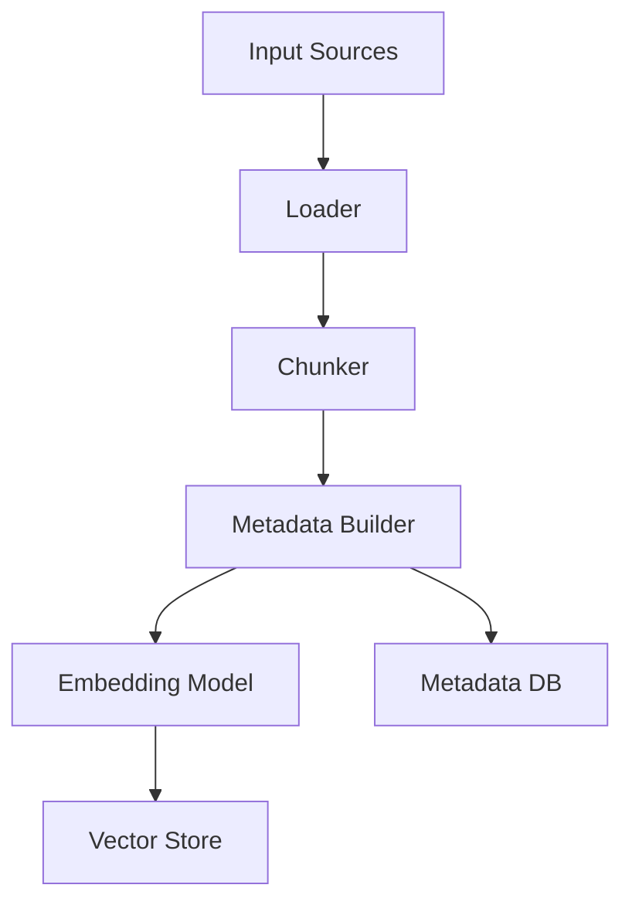
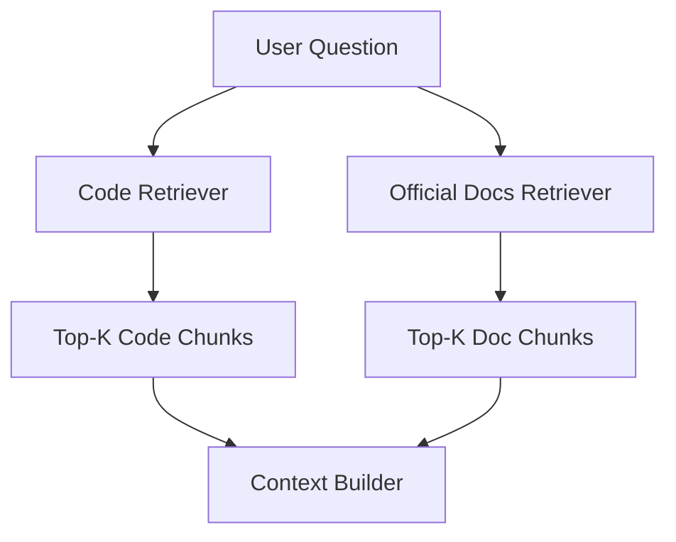

# 05. RAG Pipeline

## 1. 문서 목적

이 문서는 RAG Code Reviewer의 RAG 파이프라인을 설명합니다.

이 프로젝트의 RAG는 단순 문서 질의응답이 아니라, 코드베이스와 공식문서를 함께 검색하여 코드 설명 및 코드 리뷰를 수행하는 구조입니다.

---

## 2. RAG 전체 구조

```text
사용자 질문
  ↓
코드 검색
  ↓
공식문서 검색
  ↓
검색 결과 context 구성
  ↓
코드 리뷰 prompt 생성
  ↓
LLM 답변 생성
  ↓
답변 + 근거 반환
```

---

## 3. 인덱싱 파이프라인



인덱싱 대상은 크게 두 가지입니다.

1. 코드베이스
2. 공식문서 또는 내부문서

---

## 4. 코드 인덱싱

### 4.1 입력 대상

초기 버전에서는 로컬 프로젝트 폴더를 입력으로 받습니다.

예시:

```text
./data/sample_projects/fastapi_app
```

---

### 4.2 지원 파일

초기 지원 파일은 다음과 같습니다.

| 확장자 | 설명 |
|---|---|
| .py | Python/FastAPI 코드 |
| .md | 프로젝트 문서 |
| .yml | 설정 파일 |
| .yaml | 설정 파일 |
| .json | 설정 또는 OpenAPI 문서 |
| .env.example | 환경변수 예시 |

---

### 4.3 제외 대상

다음 디렉토리는 인덱싱하지 않습니다.

```text
.git
.venv
venv
__pycache__
node_modules
dist
build
target
```

---

### 4.4 초기 chunking 전략

초기 버전에서는 구현 난이도를 낮추기 위해 파일 단위 chunking을 우선 적용합니다.

긴 파일은 `RecursiveCharacterTextSplitter`를 사용하여 추가 분할합니다.

초기 설정 예시:

```text
chunk_size = 1200
chunk_overlap = 200
```

---

### 4.5 향후 chunking 전략

코드 리뷰 품질을 높이기 위해 향후 다음 방식으로 개선합니다.

| 단계 | 전략 |
|---|---|
| 1차 | 파일 단위 chunking |
| 2차 | Python AST 기반 함수/클래스 단위 chunking |
| 3차 | import, class, function, decorator metadata 추출 |
| 4차 | Controller → Service → Repository 호출 관계 추출 |

---

### 4.6 코드 chunk metadata

코드 chunk에는 다음 metadata를 저장합니다.

```json
{
  "source_type": "code",
  "project_id": 1,
  "file_path": "app/services/camera_service.py",
  "language": "python",
  "symbol_type": "function",
  "symbol_name": "create_camera",
  "class_name": "CameraService",
  "start_line": 10,
  "end_line": 48,
  "chunk_index": 3
}
```

초기 파일 단위 chunking에서는 symbol 관련 값이 없을 수 있습니다.

---

### 4.7 코드 embedding용 텍스트 구성

코드 원문만 embedding하면 자연어 질문과 잘 매칭되지 않을 수 있습니다.

따라서 embedding 대상 텍스트는 다음 정보를 함께 포함합니다.

```text
File: app/services/camera_service.py
Language: python
Class: CameraService
Function: create_camera

Code:
def create_camera(...):
    ...
```

향후에는 LLM 기반 요약을 추가할 수 있습니다.

```text
Summary: creates a camera, checks duplicate camera_id and stream_key, commits SQLAlchemy session.
```

---

## 5. 공식문서 인덱싱

### 5.1 입력 대상

공식문서 입력은 두 가지를 지원합니다.

1. 로컬 Markdown 파일

```text
./data/official_docs/fastapi_response.md
./data/official_docs/sqlalchemy_session.md
./data/official_docs/pydantic_model.md
```

2. URL (웹페이지)

```text
https://fastapi.tiangolo.com/tutorial/response-model/
```

URL 입력 시 `RecursiveUrlLoader`로 페이지를 가져오며, `max_depth`(기본 2, 최대 3)만큼 링크를 따라 하위 페이지까지 함께 수집합니다. `prevent_outside=true`로 도메인 밖 이동을 막고, 시작 URL의 최상위 경로 segment(예: `/ko/`)로 `link_regex`를 제한해서 같은 도메인 안의 다른 섹션(다국어 문서의 `/en/`, `/de/` 등)까지 크롤링하는 것을 막습니다. css/js/이미지 등 정적 자산 URL은 제외하고, 한 번의 요청에서 최대 150페이지까지만 수집합니다 (대상 사이트 부하와 embedding API 비용을 제한하기 위함).

---

### 5.2 공식문서 chunking 전략

공식문서는 문서 구조를 보존하는 것이 중요합니다.

URL로 가져온 HTML은 먼저 `<article>` 또는 `<main>` 태그로 본문 영역만 추출한 뒤(네비게이션, 사이드바, 배너 등 제외), `html2text`로 변환해 `<h1>~<h3>`를 `#`, `##`, `###` Markdown 헤더 문법으로 바꾸고, 로컬 Markdown 파일과 동일한 파이프라인을 탑니다. 두 태그 모두 없으면 페이지 전체를 사용합니다.

코드 예제 안의 주석(예: `# Don't do this in production!`)이 실제 Markdown 헤더로 잘못 인식되지 않도록, `html2text`의 코드 블록을 ` ``` ` fenced code block으로 변환한 뒤 헤더 분할을 적용합니다 (`MarkdownHeaderTextSplitter`는 fenced code block 내부의 `#`는 헤더로 인식하지 않음).

```text
Markdown 문서 또는 URL(HTML → html2text 변환)
  ↓
Header 기반 분할
  ↓
긴 section 추가 분할
  ↓
metadata 부여
  ↓
embedding
  ↓
vector store 저장
```

URL 크롤링으로 여러 페이지를 수집한 경우, 수집된 페이지 경로를 트리 구조 문자열(`page_tree`)로 만들어 응답과 `docs_indexing_completed` 로그에 남깁니다 (06-logging-policy.md 6.2 참고).

---

### 5.3 Header 기반 분할

Markdown header를 기준으로 의미 단위를 나눕니다.

```text
# h1
## h2
### h3
```

예시 metadata:

```json
{
  "source_type": "official_doc",
  "doc_name": "fastapi-response-docs",
  "source": "fastapi_response.md",
  "h1": "Response",
  "h2": "Return a Response directly",
  "h3": "Use jsonable_encoder",
  "chunk_index": 7
}
```

---

### 5.4 공식문서 embedding용 텍스트 구성

공식문서 chunk의 embedding 대상 텍스트는 제목 정보를 포함합니다.

```text
Document: FastAPI Response Docs
Section: Return a Response directly > Use jsonable_encoder

Content:
...
```

이렇게 하면 검색 시 section 문맥이 보존됩니다.

---

## 6. Vector Store 설계

초기 Vector Store는 Chroma를 사용합니다.

collection은 다음과 같이 분리합니다.

```text
code_chunks
official_docs_chunks
```

분리 이유:

1. 코드 검색과 공식문서 검색의 목적이 다르다.
2. source_type별 top_k를 다르게 설정할 수 있다.
3. 검색 로그 분석이 쉽다.
4. 향후 코드 검색과 문서 검색에 다른 retriever 전략을 적용할 수 있다.

---

## 7. Retrieval Pipeline



---

### 7.1 코드 검색

사용자 질문을 기반으로 코드 vector store에서 관련 chunk를 검색합니다.

기본값:

```text
code_top_k = 5
```

예시 질문:

```text
카메라 생성 API 흐름 설명해줘.
```

기대 검색 결과:

- camera router
- camera service
- camera schema
- camera model

---

### 7.2 공식문서 검색

사용자 질문을 기반으로 공식문서 vector store에서 관련 chunk를 검색합니다.

기본값:

```text
doc_top_k = 5
```

예시 질문:

```text
이 JSONResponse 사용 방식 공식문서 기준으로 괜찮아?
```

기대 검색 결과:

- FastAPI Response 직접 반환 문서
- jsonable_encoder 문서
- JSONResponse 관련 문서

---

## 8. Prompt 구성

코드 리뷰 prompt는 다음 정보를 포함합니다.

```text
1. 역할 지시
2. 사용자 질문
3. 관련 코드 context
4. 관련 공식문서 context
5. 답변 형식
6. 근거 부족 시 추측 금지 지시
```

예시 prompt 구조:

```text
너는 백엔드 코드 리뷰어다.
반드시 제공된 코드와 공식문서에 근거해서 답변해라.
근거가 부족하면 추측하지 말고 "근거 부족"이라고 말해라.

[사용자 질문]
{question}

[관련 코드]
{code_context}

[관련 공식문서]
{doc_context}

[답변 형식]
1. 결론
2. 관련 코드 위치
3. 공식문서 근거
4. 문제 설명
5. 수정 방향
6. 수정 예시
```

---

## 9. 답변 생성 정책

LLM은 다음 원칙을 따라 답변해야 합니다.

1. 검색된 코드와 문서를 근거로 답변한다.
2. context에 없는 파일이나 함수는 언급하지 않는다.
3. 공식문서 근거가 부족하면 일반적인 추측을 하지 않는다.
4. 문제 여부를 명확히 표시한다.
5. 수정 방향은 실제 코드에 적용 가능한 수준으로 제시한다.
6. 관련 코드 위치와 공식문서 출처를 함께 반환한다.

---

## 10. 출력 형식

초기 버전에서는 JSON 응답 안에 자연어 answer를 포함합니다.

향후에는 LLM 출력 자체도 구조화된 JSON으로 받을 수 있습니다.

초기 응답 예시:

```json
{
  "verdict": "PROBLEM",
  "answer": "현재 코드는 ...",
  "related_code": [],
  "official_references": []
}
```

---

## 11. 검색 품질 개선 계획

초기 버전 이후 다음 기능을 추가할 수 있습니다.

### 11.1 Query Rewriting

사용자 질문을 검색에 적합한 쿼리로 변환합니다.

예시:

```text
사용자 질문:
이 응답 반환 방식 괜찮아?

코드 검색 쿼리:
JSONResponse Pydantic response return datetime

공식문서 검색 쿼리:
FastAPI JSONResponse return Response directly jsonable_encoder
```

---

### 11.2 Multi-query Retrieval

하나의 질문에서 여러 검색 쿼리를 생성하여 누락을 줄입니다.

---

### 11.3 Reranking

Vector search 결과를 reranker로 재정렬하여 실제 관련성이 높은 chunk를 우선 사용합니다.

---

### 11.4 Metadata Filtering

프로젝트 ID, 문서 유형, 파일 확장자, framework 등 metadata 기반 필터링을 적용합니다.

---

## 12. 한계

초기 RAG 파이프라인은 다음 한계를 가집니다.

1. 코드 호출 관계를 완전히 이해하지 못할 수 있다.
2. 파일 단위 chunking은 함수 단위 chunking보다 검색 정확도가 낮을 수 있다.
3. 공식문서가 충분히 인덱싱되지 않으면 근거가 부족할 수 있다.
4. LLM이 context를 잘못 해석할 가능성이 있다.
5. 검색 결과가 부족하면 답변 품질이 크게 떨어진다.

따라서 초기 버전에서는 검색된 chunk를 함께 반환하여 사용자가 근거를 직접 확인할 수 있게 합니다.
