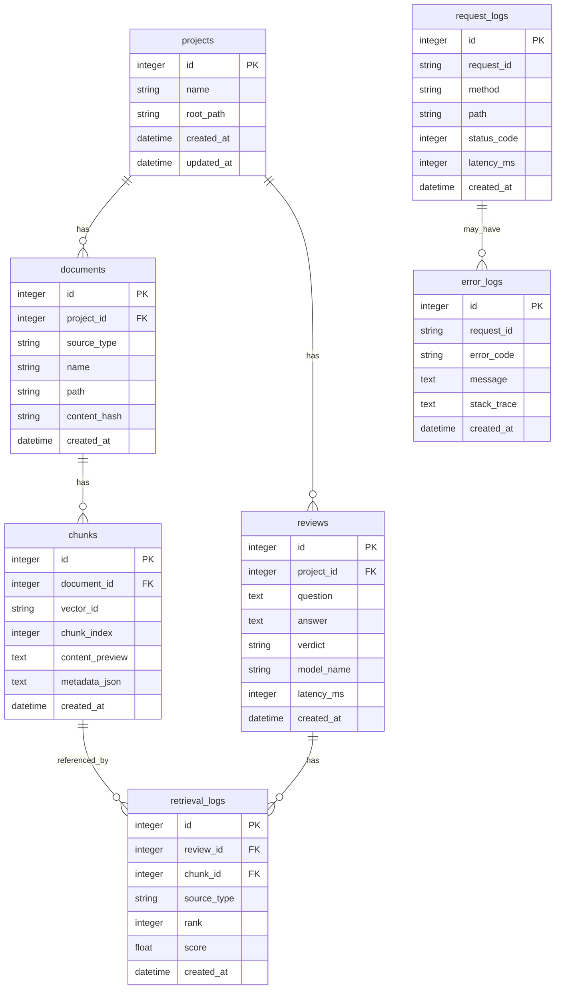

# 08. Database Schema

## 1. 문서 목적

이 문서는 RAG Code Reviewer의 초기 SQLite 기반 metadata DB 스키마를 정의합니다.

Vector embedding 자체는 Chroma에 저장하고, 프로젝트 정보, 문서 정보, chunk metadata, 리뷰 결과, 검색 로그, 요청 로그는 SQLite에 저장합니다.

---

## 2. 저장소 분리 원칙

| 저장소 | 저장 대상 |
|---|---|
| Chroma | chunk embedding vector, vector 검색용 데이터 |
| SQLite | 프로젝트, 문서, chunk metadata, 리뷰 결과, 로그 |

Vector DB에는 검색을 위한 데이터를 저장하고, SQLite에는 조회와 추적을 위한 관계형 metadata를 저장합니다.

---

## 3. ERD 초안



---

## 4. projects

분석 대상 코드 프로젝트 정보를 저장합니다.

| Column | Type | Nullable | Description |
|---|---|---|---|
| id | integer | false | PK |
| name | string | false | 프로젝트 이름 |
| root_path | string | false | 로컬 프로젝트 경로 |
| description | text | true | 프로젝트 설명 |
| created_at | datetime | false | 생성 시간 |
| updated_at | datetime | false | 수정 시간 |

### 제약 조건

- `name`은 unique로 관리하는 것을 권장합니다.
- `root_path`는 등록 시점에 존재해야 합니다.

---

## 5. documents

인덱싱된 코드 파일 또는 공식문서 파일 정보를 저장합니다.

| Column | Type | Nullable | Description |
|---|---|---|---|
| id | integer | false | PK |
| project_id | integer | true | 프로젝트 ID, 공식문서는 null 가능 |
| source_type | string | false | code, official_doc, internal_doc, error_doc |
| name | string | false | 문서 또는 파일 이름 |
| path | string | false | 파일 경로 또는 출처 |
| content_hash | string | true | 변경 감지를 위한 hash |
| created_at | datetime | false | 생성 시간 |
| updated_at | datetime | false | 수정 시간 |

### source_type

| Value | Description |
|---|---|
| code | 코드 파일 |
| official_doc | 공식문서 |
| internal_doc | 내부 문서 |
| error_doc | 에러 코드 문서 |

---

## 6. chunks

문서 또는 코드에서 생성된 chunk metadata를 저장합니다.

| Column | Type | Nullable | Description |
|---|---|---|---|
| id | integer | false | PK |
| document_id | integer | false | documents.id |
| vector_id | string | false | Chroma에 저장된 vector ID |
| chunk_index | integer | false | 문서 내 chunk 순서 |
| content_preview | text | true | chunk 미리보기 |
| metadata_json | text | true | chunk metadata JSON |
| created_at | datetime | false | 생성 시간 |

### metadata_json 예시: code

```json
{
  "source_type": "code",
  "project_id": 1,
  "file_path": "app/services/camera_service.py",
  "language": "python",
  "chunk_type": "method",
  "symbol_name": "CameraService.create_camera",
  "parent_symbol": "CameraService",
  "parent_start_line": 5,
  "parent_end_line": 60,
  "start_line": 10,
  "end_line": 48
}
```

### metadata_json 예시: official_doc

```json
{
  "source_type": "official_doc",
  "doc_name": "fastapi-response-docs",
  "source": "fastapi_response.md",
  "h1": "Response",
  "h2": "Return a Response directly",
  "chunk_index": 7
}
```

---

## 7. reviews

사용자 질문과 LLM 리뷰 결과를 저장합니다.

| Column | Type | Nullable | Description |
|---|---|---|---|
| id | integer | false | PK |
| project_id | integer | false | projects.id |
| question | text | false | 사용자 질문 |
| answer | text | false | LLM 답변 |
| verdict | string | true | PROBLEM, OK, INSUFFICIENT_CONTEXT |
| model_name | string | true | 사용한 LLM 모델명 |
| input_tokens | integer | true | 입력 토큰 수 |
| output_tokens | integer | true | 출력 토큰 수 |
| latency_ms | integer | true | 처리 시간 |
| created_at | datetime | false | 생성 시간 |

### verdict

| Value | Description |
|---|---|
| OK | 문제 없음 |
| PROBLEM | 문제 있음 |
| NEEDS_IMPROVEMENT | 개선 필요 |
| INSUFFICIENT_CONTEXT | 근거 부족 |

---

## 8. retrieval_logs

각 리뷰 요청에서 검색된 chunk 정보를 저장합니다.

| Column | Type | Nullable | Description |
|---|---|---|---|
| id | integer | false | PK |
| review_id | integer | false | reviews.id |
| chunk_id | integer | true | chunks.id |
| source_type | string | false | code 또는 official_doc |
| source | string | true | 파일 경로 또는 문서 출처 |
| rank | integer | false | 검색 순위 |
| score | float | true | 유사도 점수 |
| created_at | datetime | false | 생성 시간 |

이 테이블은 검색 품질 분석에 사용됩니다.

---

## 9. request_logs

HTTP 요청 단위 로그를 저장합니다.

| Column | Type | Nullable | Description |
|---|---|---|---|
| id | integer | false | PK |
| request_id | string | false | 요청 추적 ID |
| method | string | false | HTTP method |
| path | string | false | 요청 path |
| status_code | integer | false | HTTP status code |
| latency_ms | integer | true | 처리 시간 |
| client_ip | string | true | 클라이언트 IP |
| user_agent | string | true | User-Agent |
| created_at | datetime | false | 생성 시간 |

---

## 10. error_logs

에러 발생 정보를 저장합니다.

| Column | Type | Nullable | Description |
|---|---|---|---|
| id | integer | false | PK |
| request_id | string | false | 요청 추적 ID |
| error_code | string | false | 서비스 에러 코드 |
| message | text | false | 에러 메시지 |
| path | string | true | 요청 path |
| status_code | integer | true | HTTP status code |
| stack_trace | text | true | stack trace |
| created_at | datetime | false | 생성 시간 |

운영 환경에서는 stack_trace 저장 정책을 별도로 관리해야 합니다.

---

## 11. 인덱싱 중복 처리

파일 내용이 변경되지 않은 경우 재인덱싱을 피하기 위해 `content_hash`를 사용할 수 있습니다.

처리 방식:

```text
1. 파일 내용 hash 계산
2. documents.content_hash와 비교
3. 동일하면 skip
4. 다르면 기존 chunk 삭제 후 재인덱싱
```

초기 버전에서는 단순 force_reindex 방식으로 구현해도 됩니다.

---

## 12. 향후 확장

추후 다음 테이블을 추가할 수 있습니다.

| Table | Description |
|---|---|
| query_rewrites | 원본 질문과 재작성 쿼리 저장 |
| llm_call_logs | LLM 호출 상세 로그 저장 |
| evaluation_cases | RAG 평가용 질문/정답 저장 |
| prompt_templates | prompt version 관리 |
| repositories | GitHub repository 정보 저장 |
